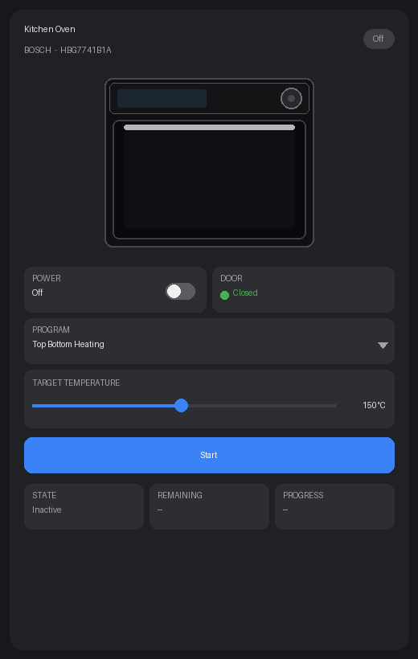
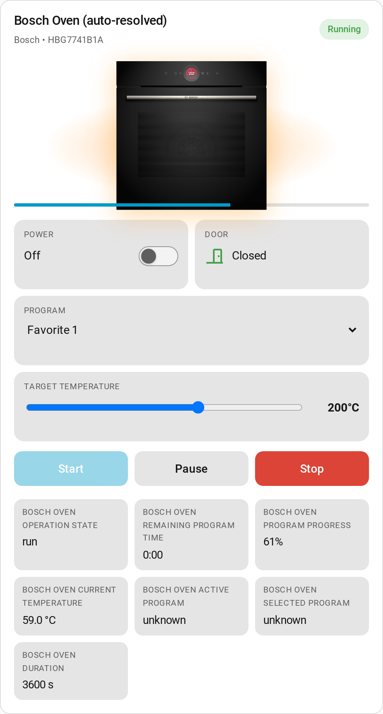
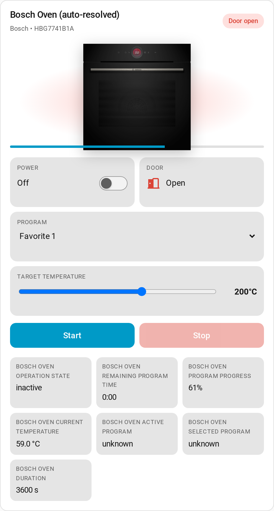

# Home Connect Oven Card

A visual Lovelace card for Home Assistant that surfaces your **Home Connect** oven's entities in one place — picture of your oven, big-button controls, and a configurable strip of sensor tiles. Works with both the official cloud **Home Connect** integration and the community **Home Connect Local** (`homeconnect_ws`) integration.

## Screenshots

> These are design mockups of the card layout — not screenshots from a live Home Assistant instance. The oven illustration is drawn for the docs; in the real card the device's product photo is fetched from BSH's CDN (see [Image matching](#image-matching)).

| Idle (oven off) | Running (program active) | Door open |
| :---: | :---: | :---: |
|  |  |  |
| Title, status pill, controls grid, sensor strip with placeholders. | Progress bar across the image, Pause + Stop buttons, live remaining time and progress. | Red "Door open" status pill, red door indicator, Start button dimmed. |

## Features

- **Auto-detects oven entities** from a single device picker — no per-entity wiring.
- **Optional oven photo** — set `image_url` to a picture of your oven; otherwise a clean built-in oven icon is shown.
- **Visual controls**: power switch, program selector, target temperature slider, child lock, start / pause / resume / stop buttons.
- **Door state** indicator (with a red pill in the header when the door is open).
- **Configurable sensor tiles** — pick any subset of operation state, remaining time, progress, current cavity temperature, etc.
- **Visual editor** — set everything from the Lovelace UI.

## Requirements

- Home Assistant `2024.4` or newer.
- One of these integrations installed, with at least one oven added:
  - the official [Home Connect integration](https://www.home-assistant.io/integrations/home_connect) (cloud), or
  - the community **Home Connect Local** (`homeconnect_ws`) integration.

Both are auto-detected in the device picker, and the card auto-resolves each integration's
entity names (they differ slightly). If a control doesn't resolve on your setup, pin it
explicitly with the `entities:` override block (see below).

## Installation

### Via HACS (recommended)

1. Push this repo to your own GitHub account (or fork it).
2. In Home Assistant → **HACS → Frontend → ⋮ → Custom repositories**.
3. Add the repo URL with category **Lovelace** (a.k.a. Dashboard plugin).
4. Install **Home Connect Oven Card**, then **hard-refresh** your browser.

HACS will fetch `home-connect-oven-card.js` (either the GitHub release asset built by the included Actions workflow, or `dist/home-connect-oven-card.js` if you committed it) and register it as a Lovelace resource automatically.

### Manual

1. Download `home-connect-oven-card.js` from the latest GitHub release (or from `dist/` after running `npm run build`).
2. Copy it to `<config>/www/`.
3. In **Settings → Dashboards → Resources**, add `/local/home-connect-oven-card.js` as a **JavaScript module**.

### Cutting a release

The included `release.yml` workflow runs `npm ci && npm run build` whenever you push a `v*` tag and attaches `dist/home-connect-oven-card.js` to the GitHub release. Typical flow:

```bash
git tag v0.1.0
git push origin v0.1.0
```

HACS then picks up the new version on its next scan.

## Usage

After installing, add the card from the dashboard UI — it appears as **Home Connect Oven Card** in the card picker, with a visual editor.

### Minimal YAML

```yaml
type: custom:home-connect-oven-card
device_id: 1234abcd5678ef90  # pick this in the visual editor
```

### Fully configured YAML

```yaml
type: custom:home-connect-oven-card
device_id: 1234abcd5678ef90
name: Kitchen Oven
image_url: https://example.com/my-oven.png   # optional override
show_image: true
show_controls: true
show_program_select: true
show_temperature: true
show_door: true
show_child_lock: false
sensors:
  - operation_state
  - remaining_program_time
  - program_progress
  - current_cavity_temperature
entities:
  # Optional — override auto-resolved entities individually
  setpoint_temperature: number.kitchen_oven_setpoint_temperature
```

### Configuration options

| Option | Type | Default | Description |
|---|---|---|---|
| `device_id` | string | — | The Home Connect device. Set via the editor. |
| `name` | string | device name | Override the card title. |
| `image_url` | string | — | Custom image URL. Overrides the bundled lookup. |
| `show_image` | bool | `true` | Show the oven image. |
| `show_controls` | bool | `true` | Show the controls grid. |
| `show_program_select` | bool | `true` | Show the program selector. |
| `show_temperature` | bool | `true` | Show the target-temperature slider. |
| `show_door` | bool | `true` | Show the door state tile. |
| `show_child_lock` | bool | `false` | Show the child lock toggle. |
| `sensors` | array | see below | Which sensors to render as tiles. |
| `entities` | object | — | Per-key overrides for auto-resolved entities. |

Default sensors: `operation_state`, `remaining_program_time`, `program_progress`, `current_cavity_temperature`.

Available sensor keys: `operation_state`, `remaining_program_time`, `program_progress`, `current_cavity_temperature`, `active_program`, `selected_program`, `duration`, `door`. You can also pass a raw `entity_id` (e.g. `sensor.kitchen_oven_energy`) to add any sensor.

## Oven image

By default the card shows a clean built-in oven icon. To display a real photo of your oven,
set `image_url` to any image URL (visual editor: *Custom oven image URL*):

```yaml
type: custom:home-connect-oven-card
device_id: 1234abcd5678ef90
image_url: /local/my-oven.png   # e.g. a photo saved under <config>/www/
```

A good source is your appliance's product shot from the manufacturer's website or spec sheet.
If the URL fails to load, the card falls back to the built-in icon rather than showing a broken
image.

## Development

```bash
npm install
npm run build      # produces dist/home-connect-oven-card.js
npm run watch      # rebuild on save
```

### About the prebuilt `dist/home-connect-oven-card.js`

The prebuilt bundle in this repo loads Lit from a public CDN at runtime:

```js
import {...} from "https://cdn.jsdelivr.net/gh/lit/dist@3.1.4/all/lit-all.min.js";
```

This keeps the bundle small (~24 KB) and lets HACS install work out of the box, but it requires the Home Assistant frontend to reach `cdn.jsdelivr.net`. If you'd rather have a fully self-contained bundle (Lit inlined, no external fetch), run `npm install && npm run build` locally and replace `dist/home-connect-oven-card.js` — the Rollup config produces a single offline-capable file.

## License

MIT.
